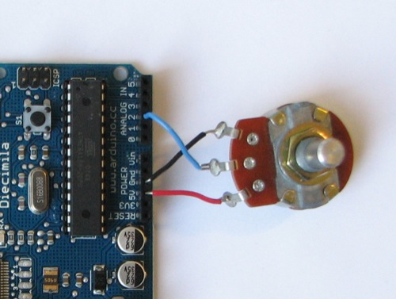

# Potentiometer to Processing

## Montage



## Code

### Arduino

```java
int potPin = 2; // Numéro du pin du potentiomètre
int val = 0;

void setup() {
  Serial.begin(9600);
}

void loop() {
  val = analogRead(potPin);
  Serial.println(val);

  delay(50); // On ajoute un délai pour stabiliser l'envoi répété des données
}
```

### Processing

```java
// On importe la librairie serial (pour parler à Arduino)
import processing.serial.*;

// On crée un objet de type Serial (pour parler à Arduino)
Serial myPort;  

int radius = 0;

void setup() {
  // On crée une fenêtre Processing
  size(500, 500);

  // On affiche la liste des ports de l'ordi
  // pour trouver le port de la carte Arduino
  println(Serial.list());

  // On sélectionne le bon port sur lequel est branchée la carte Arduino
  String portName = Serial.list()[9];

  // On crée la connexion avec Arduino 
  myPort = new Serial(this, portName, 9600);
  myPort.bufferUntil('\n');
}

void draw() {

  background(0);
  fill(255);
  noStroke();
  ellipse(0, 0, radius, radius);
}


void serialEvent (Serial myPort) {
  String inString = myPort.readStringUntil('\n');

  if (inString != null) {
    inString = trim(inString);

    radius = int(inString);
    
    println(inString);
    println(radius);
  }
}
```
